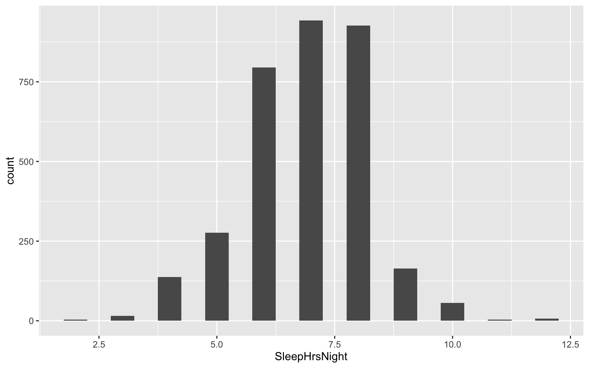
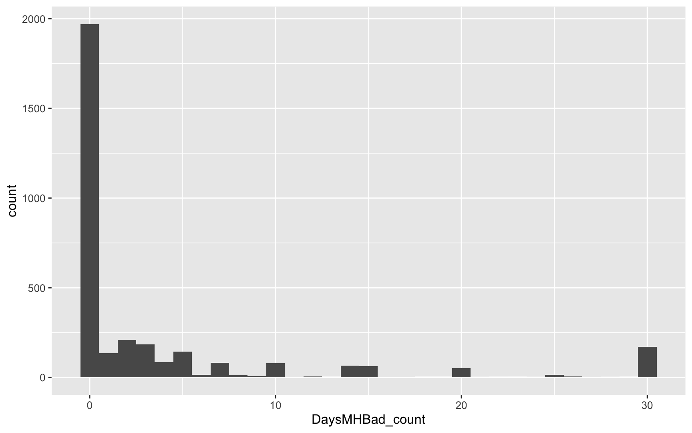
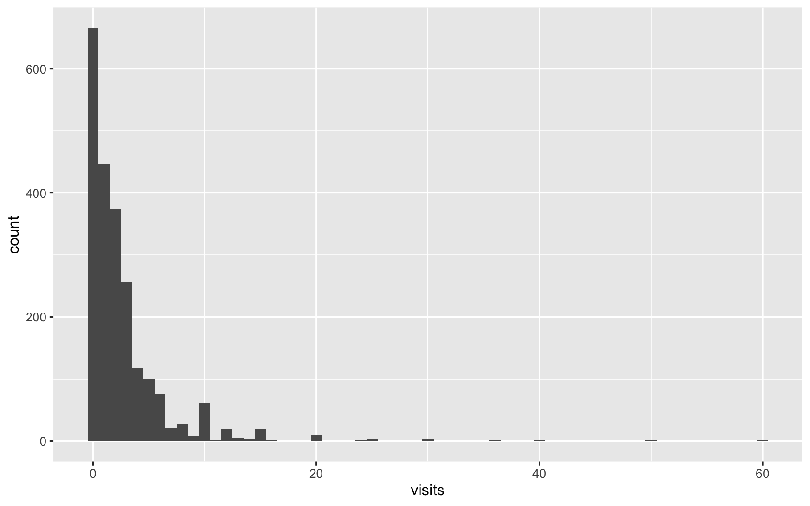
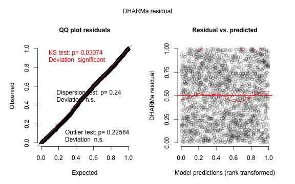
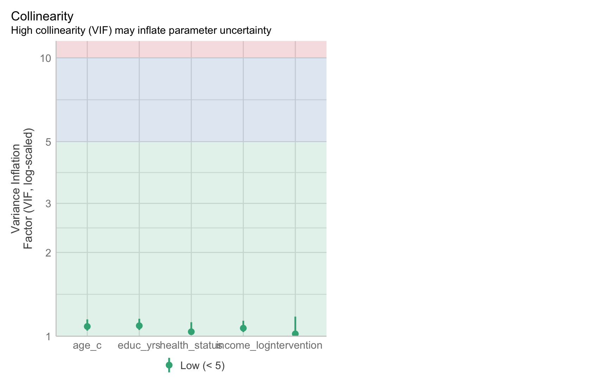
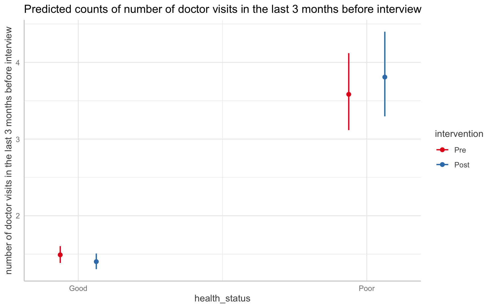

# Recap: What makes a count outcome a count?

Counts indicate how many of an outcome are present, or often, how many of an outcome are present *in a specific timeframe* (aka a *rate*).


--
In addition, a distribution of counts is:


--
- Usually *skewed*, meaning that some values are much more common than others - often a lot, or none at all (zero).


--
- Often *overdispersed*, which means the counts vary more than would be expected.


--
Counts/rates require analyses that account for these properties. These methods are similar to those used for dichotomous outcomes (remember that another way of thinking of counts is that they measure a series of dichotomous outcomes).


---
# Normally distributed data

We previously looked at a more normally distributed variable from NHANES: `SleepHrsNight`, the self-reported number of hours of sleep a participant usually gets.


--

```r
NHANES_data1112 %>% 
  ggplot(aes(SleepHrsNight)) +
  geom_histogram(binwidth = 0.5)
```




---
# Count data

`DaysMHBad_count`, the number of days per month an NHANES participant reports experiencing poor mental health.


--

```r
NHANES_data1112 %>% 
  ggplot(aes(DaysMHBad_count)) +
  geom_histogram(binwidth = 1)
```




---
class: middle, inverse

# Analyzing count data

---
# Options for analysing count data


--
<span style = "color:green"> Linear regression: </span>Count outcome variables are sometimes log-transformed and analyzed using OLS regression. 


--
- Many issues in addition to violating model assumptions, including biased estimates and loss of data because it is necessary to take the log of zero (which is undefined).


--
<span style = "color:green"> Poisson regression: </span>Often used for modeling count data. 


--
<span style = "color:green"> Negative binomial regression: </span>Similar to Poisson regression, but relaxes the restrictive assumption of the Poisson model that the mean of the count outcome equals the variance of the outcome.


--
<span style = "color:green"> Zero-inflated regression model: </span>Used to account for excess zeros produced by a different process from "true" zeros. 


---
# Assessing variability

We can get a preliminary sense of whether overdispersion is present by comparing the mean and variance of the `DaysMHBad_count` variable we looked at earlier. Here we'll limit the data to participants 16 or older because the independent variable we'll look at shortly was not measured in participants under 16.


--

```r
NHANES_data1112 %>% 
  filter(Age >= 16) %>% 
  summarize(mean = mean(DaysMHBad_count),
            variance = var(DaysMHBad_count))
```

                   ┌──────────────────┐
                   │  mean   variance │
                   ├──────────────────┤
                   │  3.88       59.5 │
                   └──────────────────┘

Column names: mean, variance


--
The variance of the counts far exceeds the mean, suggesting overdispersion. We'll formally assess overdispersion of model *residuals* once we've fitted our models. 


--
This said, these values are a good indication that we should go with negative binomial regression, but we'll compare it against a Poisson regression model to confirm. 


---
# Fitting a model

Here, we'll look at whether there is a relationship between participants' self-reported sleep quality (`Sleep_Trouble`) and the number of days per month they have poor mental health (`DaysMHBad_count`). To fit a negative binomial model we'll use the `glm.nb` function from the MASS package (included with R).

--

```r
library(MASS)
mod_1 <- glm.nb(DaysMHBad_count ~ Sleep_Trouble, 
                data = NHANES_data1112)
```


--
Fitting a comparable Poisson model for a comparison of fit. 


```r
mod_1b <- glm(DaysMHBad_count ~ Sleep_Trouble, family = poisson(),
              data = NHANES_data1112)
```

---
# Fitting a model

--
.pull-left[
**Deviance:**


```r
mod_1b$deviance # Poisson
```

```
#> [1] 33116.23
```

```r
mod_1$deviance # Neg Binom
```

```
#> [1] 2652.866
```
]


--
.pull-right[
**AIC:**


```r
mod_1b$aic # Poisson
```

```
#> [1] 38025.25
```

```r
mod_1$aic # Neg Binom
```

```
#> [1] 13187.78
```
]


--
And most critically, we can see that the Poisson gave us much smaller standard errors, which would produce artificially narrow confidence intervals. 


```r
summary(mod_1b)$coefficients[2, "Std. Error"] # Poisson
```

```
#> [1] 0.01774997
```

```r
summary(mod_1)$coefficients[2, "Std. Error"] # Neg Binom
```

```
#> [1] 0.09383608
```


---
# Fitting a model

We can also look at whether the negative binomial model better accounts for overdispersion. We'll use the DHARMa package again. 


--

```r
mod_1_residuals <- simulateResiduals(mod_1)
testDispersion(mod_1_residuals, 
               alternative = "greater", plot = F)
```

```
#> 
#> 	DHARMa nonparametric dispersion test via sd of
#> 	residuals fitted vs. simulated
#> 
#> data:  simulationOutput
#> dispersion = 0.58444, p-value = 1
#> alternative hypothesis: greater
```


--
Compared with the Poisson:


--
.pull-left[

```r
mod_1b_residuals_p$statistic
```

```
#> dispersion 
#>   14.74392
```
]


--
.pull-right[

```r
mod_1b_residuals_p$p.value
```

```
#> [1] 0
```
]

---
# Basic interpretaton 

Like logistic regression, we have to exponentiate the model coefficients to interpret the results. With counts, the exponentiated coefficient is a **rate ratio**.


--

```r
mod_1 %>% 
  broom::tidy(exponentiate = TRUE, conf.int = TRUE)
```

 ┌───────────────────────────────────────────────────────
 │ term       estimate   std.erro   statisti    p.value  
 │                              r          c             
 ├───────────────────────────────────────────────────────
 │ (Interce        3       0.0492      22.3    3.28e-11  
 │ pt)                                                0  
 │ Sleep_Tr        2.1     0.0938       7.91   2.64e-15  
 │ oubleYes                                              
 └───────────────────────────────────────────────────────

Column names: term, estimate, std.error, statistic,
p.value, conf.low, conf.high

5/7 columns shown.


--
- Compared with participants who do not have trouble sleeping, participants who have trouble sleeping on average experience 2.13 times as many days per month with poor mental health (95% CI [1.78, 2.57]). 


--
- On average, participants who have trouble sleeping experience 113% more poor mental health days each month (95% CI [1.78, 2.57]) than participants who do not have trouble sleeping.


---
# drvisits data

Let's look at data from a study that uses a common design in the social sciences: a single-group pre-post study, where one group is exposed to an intervention and the difference in the outcome measure before and after the intervention is compared.


--
The `drvisits` dataset includes the following variables:

* 

---
# Number of visits 


```r
drvisits %>% 
  ggplot(aes(visits)) +
  geom_histogram(binwidth = 1)
```



---
# Initial model

First we'll fit our initial model, which will be a Poisson model and include the number of visits as the outcome and time point of the intervention (before/after) as the IV. We'll include a random intercept for patients, because the data the observations are clustered within patients. 
 

```r
drvisits_m1 <- glmer(visits ~ intervention + (1 | id),
                     family = poisson(), data = drvisits)
```

---
# Examine overdispersion

Next, we'll look at the results of the dispersion test from DHARMa to decide if we should use a negative-binomial model instead of Poisson. 


```r
drvisits_m1_residuals <- simulateResiduals(drvisits_m1 , n = 1000) 
testDispersion(drvisits_m1_residuals, alternative = "greater", plot = F)
```

```
#> 
#> 	DHARMa nonparametric dispersion test via sd of
#> 	residuals fitted vs. simulated
#> 
#> data:  simulationOutput
#> dispersion = 1.1013, p-value = 0.232
#> alternative hypothesis: greater
```


--
This suggests we don't have concerning overdispersion in the model residuals, so we'll stick to the more parsimonious Poisson. 


---
# Adding covariates

In many research areas, there can often be a relatively standard set of sociodemographic characteristics that are  controlled for. We'll imagine this is the case here, and add a set of control variables next. 


--

```r
drvisits_m2 <- glmer(visits ~ intervention + educ_yrs + income_log + 
                       age_c + health_status + (1 | id), 
                     family = poisson(),
                     data = drvisits,
                     control = glmerControl(optimizer = "bobyqa",
                               optCtrl = list(maxfun = 2e5)))

anova(drvisits_m1, drvisits_m2, test ="Chisq")
```

   ┌───────────────────────────────────────────────────
   │ npar        AIC        BIC     logLik   deviance  
   ├───────────────────────────────────────────────────
   │    3   9.54e+03   9.55e+03   -4.77e+0   9.53e+03  
   │                                     3             
   │    7   9.31e+03   9.35e+03   -4.65e+0   9.29e+03  
   │                                     3             
   └───────────────────────────────────────────────────

Column names: npar, AIC, BIC, logLik, deviance, Chisq,
Df, Pr(>Chisq)

5/8 columns shown.


--

```r
performance::compare_performance(drvisits_m1, drvisits_m2, 
                                 metrics = "common") 
```

 ┌───────────────────────────────────────────────────────
 │ Name       Model           AIC     AIC_wt        BIC  
 ├───────────────────────────────────────────────────────
 │ drvisits   glmerMod   9.54e+03   2.21e-50   9.55e+03  
 │ _m1                                                   
 │ drvisits   glmerMod   9.31e+03   1          9.35e+03  
 │ _m2                                                   
 └───────────────────────────────────────────────────────

Column names: Name, Model, AIC, AIC_wt, BIC, BIC_wt,
R2_conditional, R2_marginal, ICC, RMSE

5/10 columns shown.


---
# Assumptions and diagnostics

Inspect residuals:


```r
drvisits_m2_residuals <- simulateResiduals(drvisits_m2 , n = 1000) 
plot(drvisits_m2_residuals)
```




                                     
---
# Assumptions and diagnostics

We can also formally test for zero inflation, again using DHARMa:


```r
testZeroInflation(drvisits_m2, plot = FALSE)
```

```
#> 
#> 	DHARMa zero-inflation test via comparison to
#> 	expected zeros with simulation under H0 = fitted
#> 	model
#> 
#> data:  simulationOutput
#> ratioObsSim = 1.1448, p-value < 2.2e-16
#> alternative hypothesis: two.sided
```


--
Even if the test had been significant, is our outcome one where there could be plausible mechanisms for excess zeros?

---
# Assumptions and diagnostics

Checking multicollinearity visually using the `check_model()` function from the *performance* package.


```r
performance::check_model(drvisits_m2, check = "vif")
```




---
# Examining moderation


```r
drvisits_m2_int <- glmer(visits ~ intervention + educ_yrs + 
                           income_log + health_status*intervention + 
                           (1 | id), 
                         family = poisson(),
                         data = drvisits,
                         control = glmerControl(optimizer = "bobyqa",
                                       optCtrl = list(maxfun = 2e5)))
```

---
# Examining moderation


```r
drvisits_m2_int %>% 
  broom.mixed::tidy(exponentiate = TRUE, conf.int = TRUE, effects = "fixed") %>% 
  select(term:conf.high)
```

```
#> Error in select(., term:conf.high): unused argument (term:conf.high)
```


--
Even though the interaction is nonsignificant, it might be informative to look at the predicted counts broken out by health status since it is a strong main effect, 


---
# Examining moderation


```r
# using the ggeffects package
drvisits_m2_int_probs <- predict_response(drvisits_m2_int,
                                    type = "fe",
                                    terms = c("health_status", "intervention"),
                                    margin = "marginalmeans")
```


---
# Examining moderation


```r
print(drvisits_m2_int_probs)
```

```
#> # Predicted counts of number of doctor visits in the last 3 months before interview
#> 
#> intervention: Pre
#> 
#> health_status | Predicted |     95% CI
#> --------------------------------------
#> Good          |      1.49 | 1.38, 1.60
#> Poor          |      3.58 | 3.12, 4.12
#> 
#> intervention: Post
#> 
#> health_status | Predicted |     95% CI
#> --------------------------------------
#> Good          |      1.40 | 1.30, 1.51
#> Poor          |      3.81 | 3.30, 4.40
#> 
#> Adjusted for:
#> *   educ_yrs = 11.51
#> * income_log =  7.71
```

---
# Examining moderation


```r
plot(drvisits_m2_int_probs)
```



---
# Ignoring dependency

What if we used a simple fixed-effect model instead of accounting for the dependency between patients' observations before and after the intervention?


```r
drvisits_m1 <- glmer(visits ~ intervention + (1 | id),
                     family = poisson(), data = drvisits)
```


```
#> Error in select(., term:conf.high): unused argument (term:conf.high)
```

*Versus*


```r
drvisits_fixed <- glm(visits ~ intervention,
                      family = poisson(), data = drvisits)
```


```
#> Error in UseMethod("to_md"): no applicable method for 'to_md' applied to an object of class "c('tbl_df', 'tbl', 'data.frame')"
```


