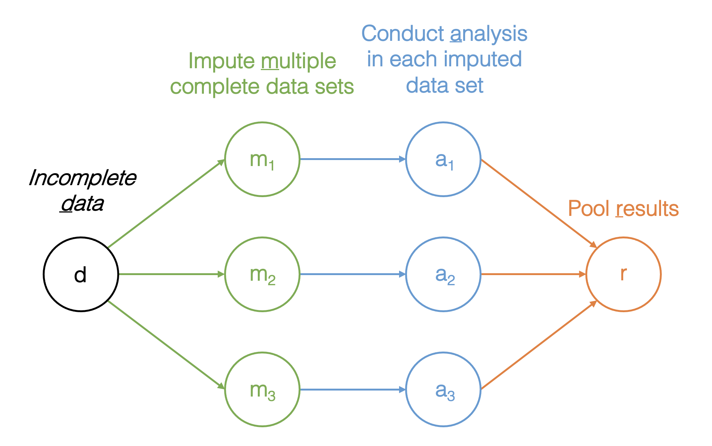

```{R, setup, include = F}
library(pacman)
p_load(here, tidyverse, rio, xaringan, dplyr, knitr, xaringanthemer, kableExtra, lfe, arsenal, foreign, reshape2, ggpubr, broom, stargazer, fixest, gtsummary, huxtable, mice, miceadds, VIM, magrittr, DiagrammeR, missMethods)

theme_set(theme_classic())

i_am("slides/EDUC645_cleaning_missing_Sp23.rmd")

red_pink <- "#e64173"
turquoise = "#20B2AA"
orange = "#FFA500"
red = "#fb6107"
blue = "#3b3b9a"
green = "#8bb174"
grey_light = "#B3B3B3"
grey_mid = "#7F7F7F"
grey_dark = "grey20"
purple = "#6A5ACD"
slate = "#314f4f"
extra_css <- list(
  ".red"   = list(color = "red"),
  ".blue"  =list(color = "blue"),
  ".red-pink" = list(color= "red_pink"),
  ".gray" = list(color= "#B3B3B3"),
  ".purple" = list(color = "purple"),
  ".small" = list("font-size" = "90%"),
  ".large" = list("font-size" = "120%"),
  ".tiny" = list("font-size" = "70%"),
  ".tiny2" = list("font-size" = "50%"))
write_extra_css(css = extra_css, outfile = "my_custom.css")

# Knitr options
opts_chunk$set(
  comment = "#>",
  fig.align = "center",
  fig.height = 6.75,
  fig.width = 10.5,
  warning = F,
  message = F
)

galo_complete <- rio::import(here::here("data", "galo.csv")) %>% 
  drop_na()

galo_miss <- missMethods::delete_MCAR(galo_complete, 0.20, cols_mis = "score")
galo_miss <- missMethods::delete_MCAR(galo_miss, 0.50, cols_mis = c("medu", "fedu", "focc"))
galo_miss <- missMethods::delete_MNAR_censoring(galo_miss, 0.40, cols_mis = "advice")

```


# Impacts of missing data 


--
Most analyses drop observations with missing data, so missingness can reduce the number of useful observations (and therefore reduce power/precision).


--
Missingness induces bias:


--
- If the data were sampled to be representative of a population, the incomplete data may no longer be representative.


--
- If the data were intended to be randomized across groups (e.g., intervention conditions), the incomplete data may no longer be balanced across observed and/or unobserved confounders.


--
- The remaining observations may represent biased characteristics (e.g., sickest, most likely to drop out).


--
Until fairly recently, we have been limited in our ability to recover power and (true) variability.


---
# Missing data mechanisms

There are 3 forms of missingness:


--
<span style = "color:green"> Missing Completely at Random (MCAR): </span>Missingness is unrelated to a variable's values.

- We can delete observations without introducing bias, but power is reduced.


--
<span style = "color:green"> Missing at Random (MAR): </span>Missingness is related to values in the data, but can be explained by other values in the data.

- Bias is introduced, and power is reduced (both can be recovered).

- Generally (assumed to be) the most common form of missingness.


--
<span style = "color:green"> Missing Not at Random (MNAR): </span>Missing data are caused by an individual’s value of the variable.

- Bias is introduced, and power is reduced (both can sometimes be partially recovered).


--
<span style = "color:red"> All forms can be present within the same data (i.e., the missing data mechanism can differ across variables). </span>


---
# Traditional methods for treating missingness


--
<span style = "color:green"> Listwise or case deletion: </span>Deleting observations with missing data.


--
 - Reduces power and may introduce bias

 - Impactful for multivariate analysis: Missingness across many variables, even if missing data are few, can lead to large number of deleted observations.


--
<span style = "color:green"> Mean substitution: </span>Replace missing values on a variable with average of that variable.
  - May reduce variability, reduce power, and distort covariances and intercorrelations among variables


--
<span style = "color:green"> Hot-decking: </span>Replaces missing values with random observed values. 
  - Only considers information from the one variable with missingness


--
<span style = "color:green"> Last observation carried forward (LOCF): </span>
  - Reduces variability


---
# Imputation

Traditional methods that replace missing values (versus deleting observations) either ignore relationships among variables in the dataset.


--
Modern methods use the underlying structure of the data to replace missing values with new values that could have been observed, had they not been missing.

- Structure is composed of the relations (variability) in the data, and the uncertainty with which those relations are known/measured.


--
Two most common modern approaches:


--
- <span style = "color:green"> Full-information maximum-likelihood (FIML) imputation: </span>Aims to estimate model *parameters* (e.g., slopes, intercepts) as near as possible to what their values would have been when estimated from complete data.

 - Model-specific and limited to models that are estimated using maximum-likelihood estimation


--
- <span style = "color:green"> Multiple imputation (MI) </span>Aims to impute complete data that once imputed, can be used for multiple analyses. 

 - Not model-specific and therefore more versatile 


---
# Multiple imputation 

MI builds on another single imputation method, which involves regressing missing values on other observed values in the dataset.


--
Conducting this process once may produce a value which is plausible, but incorrect; repeating the process, and then merging (averaging) each estimate of the missing data point, produces a more accurate (and plausible) value.


--
Merging (or pooling) multiple imputed datasets also accounts for the uncertainty in the imputation process.


---
# Multiple imputation process

.center[]

---
# Example dataset 

GALO is a 1959 dataset that includes 1,382 sixth grade students in Groningen, Netherlands. 


--
We might ask: What is the relationship between a teacher's recommendation on secondary school choice and student's GALO score?


--
Missingness on each variable:

```{r}
missMethods::count_NA(galo_miss)
```

---
# Listwise deletion

```{r}
m1 <- lm(advice ~ score, data = galo_miss)
m2 <- lm(advice ~ score + female + medu + fedu + focc, data = galo_miss)
```


--
```{r, echo = F}
list("List" = m1,
     "List (covariates)" = m2) %>% 
  huxreg(coefs = c("score"), statistics = c(N = "nobs", R2 = "r.squared"))
```


---
# Mean imputation

```{r, echo = F}
galo_mean <- missMethods::impute_mean(galo_miss)

# Rerun the analysis:

m3 <- lm(advice ~ score, data = galo_mean)

m4 <- lm(advice ~ score + female + medu + fedu + focc,  data = galo_mean)

list("List" = m1,
     "List (covariates)" = m2,
     "Mean" = m3,
     "Mean (covariates)" = m4) %>% 
  huxreg(coefs = c("score"), statistics = c(N = "nobs", R2 = "r.squared"))
```


---
# Comparing to results with complete data

```{r, echo=FALSE}
m5 <- lm(advice ~ score, data = galo_complete)

m6 <- lm(advice ~ score + female + medu + fedu + focc,  data = galo_complete)

list("List" = m1,
     "List (cov)" = m2,
     "Mean" = m3,
     "Mean (cov)" = m4,
     "Comp" = m5,
     "Comp (cov)" = m6) %>% 
  huxreg(coefs = c("score"), statistics = c(N = "nobs", R2 = "r.squared"))
```

---
# Multiple imputation (MI) steps

The first step is to examine the patterns and distributions of missing data. Then, we impute multiple datasets and inspect diagnostic plots. Finally, we carry out the analyses. The `mice` and `VIM` packages are necessary.


--
```{r, fig.retina=3}
VIM::marginplot(galo_miss[, c("advice", "medu")])
# Red dots are missing values on the variable on the alternate axis
```


---
# Missing data pattern

```{r, fig.retina=3}
galo_miss %>% select(advice, medu, fedu, focc) %>% 
  md.pattern(rotate.names = TRUE)
```


---
# Imputation

To impute, we specify the imputation algorithm, the number of imputed data sets (`m`: default is 5, but 20 or more is better), and the number of iterations (`maxit`: default, 10 is better). 

```{r, results='hide'}
galo_multi <- mice(galo_miss, method = "pmm", m = 20, maxit = 10) 
```


--
Predictive mean matching (`pmm`) is the default and usually works well, but will sometimes encounter issues with categorical data. Another good option is classification and regression trees (`cart`).


---
# Examine imputation plots

```{r, fig.retina=3}
densityplot(galo_multi)
# Red lines are imputed value distributions, blue are observed values
```


---
# Examine imputation plots

```{r, fig.retina=3}
stripplot(galo_multi, pch = 5, cex = 1.2)
# Red dots are imputed values, blue are observed values
```


---
# Model fitting

Because we have multiple datasets, the approach to conducting analyses in multiply imputed data is to fit the model in *each* dataset, then to pool the parameters from each model. 


--
Fortunately, we don't have to do this manually:

```{r}
est1 <- with(galo_multi, lm(advice ~ score))
est2 <- with(galo_multi, lm(advice ~ score + 
                              female + medu + fedu + focc))
```


---
# Model results

```{r}
summary(pool(est2)) # Be sure to include pool()
# For ratio outcomes: 
# summary(pool(est2), conf.int = TRUE, exponentiate = TRUE)
```


---
# Compared with complete data

```{r, echo=FALSE}
list("Comp" = m5,
     "Comp (cov)" = m6,
     "MI" = pool(est1),
     "MI (cov)" = pool(est2)) %>% 
  huxreg(coefs = c("score"), statistics = character(0))
```

---
# Other important functions

--
Deviance test:

```{r}
anova(est1, est2)
```


--
$R^2$
```{r}
pool.r.squared(est2)
```


--
Final note: `mice` and its add-on packages have functions for imputing nested (multilevel) data, which should be used when needed. 

---
# Best Reporting Practices

--
* Report the percent/proportion of data missing on variables in analyses.


--
* Indicate the primary reason you believe data are missing and briefly justify your assumption.


--
* Report the imputation method. If using MI, report the number of imputed data sets and mention algorithm used.


--
* Cite the software/package used to impute data.


--
* If there is substantial missingness, conduct and mention a sensitivity analysis of primary analyses using the imputed data and complete case analyses.

---
# To Dos

### Reading
- Read Dunn et al 2014 (Canvas) before June 6 class


### Quiz
- Final quiz due June 6 (posts tomorrow on Canvas)


### Assignments
- Final project due June 13
 
